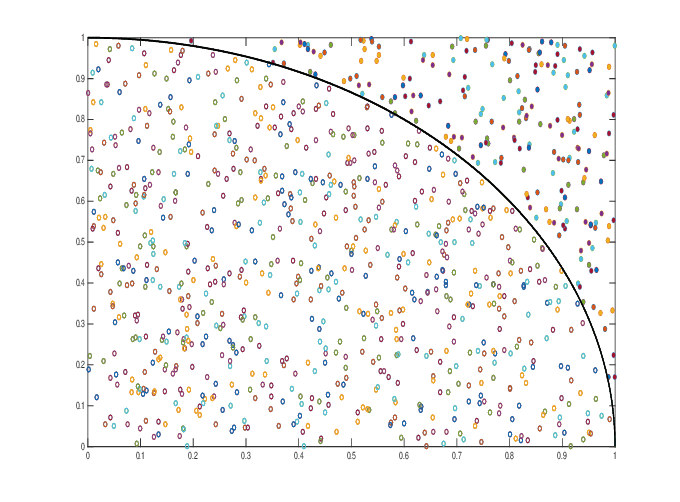

<div class="HEADER drawer">

</div>

# Introduction

The one dimensional integral that we shall evaluate using monte-carlo
methods gives the area of the a quarter of the unit circle. Using this
and the fact that the analytical value of the are of a quarter of the
unit circle is given as $\pi/4$, we can find the value of $\pi$.

$$
\theta = \int_0^1 \sqrt{1-x^2}\ dx = \frac{\pi}{4}
$$


The goal is to understand the strengths and weaknesses of the various
monte-carlo methods for the purpose of numerical integration.

# Monte-Carlo methods

Here, we shall test the various algorithms for numerical integration and
check their labour ratio.

## Hit and Miss

The crude method is the simplest and most inefficient monte-carlo
algorithm. It simply involves generating uniformly distributed random
points inside the unit square and counting the ratio of those points
that lie within the quarter circle. This gives us the ratio of the area
of the square and the circle. Since the are of the unit square is 1, the
are of the circle can be deduced directly.



The algorithm involves simply generating uniformly distributed set of
points within the range (0-1). The estimator for the

### Code

1.  Functions

    ``` python
    def hit_or_miss(p):
        (x, y) = p
        if np.sqrt(x**2 + y**2) > 1:
            return(0)
        else:
            return(1)

    def hit_or_miss_var(inp):
        (x, meanpi) = inp
        return((x-meanpi)**2)
    ```

2.  Simulation

    ``` python
    nb=22
    corrlen=0
    npoints=(1 << nb )
    npointsall=(1 << nb ) + corrlen
    randvalsx = np.random.rand(npointsall);
    randvalsy = np.random.rand(npointsall);
    pivalslist=np.zeros(npointsall);

    # Calculate via MC simul
    meanpi = st.mean(map(hit_or_miss, zip(randvalsx,randvalsy)))
    pivals = map(hit_or_miss, zip(randvalsx,randvalsy))
    meanpilist = meanpi*np.ones(npoints);
    varpivals = map(hit_or_miss_var, zip(pivals,meanpilist))
    errorpi=np.sqrt(sum(varpivals)/(npoints-1))/np.sqrt(npoints)
    # π
    exactI=np.pi/4
    print(f'meanpi = {meanpi} exact={exactI} \n error={errorpi} errorExact={exactI-meanpi}')

    ```

## Crude monte-carlo

The crude method is the simplest and most inefficient monte-carlo
algorithm. It simply involves generating uniformly distributed random
points inside the unit square and counting the ratio of those points
that lie within the quarter circle. This gives us the ratio of the area
of the square and the circle. Since the are of the unit square is 1, the
are of the circle can be deduced directly.


The algorithm involves simply generating uniformly distributed set of
points within the range (0-1). The estimator for the

### Code

1.  Functions

    ``` python
    def pi_curve(x):
        return(np.sqrt(1.0 - x*x))

    def pi_curve_var(inp):
        (x, meanpi) = inp
        return((x-meanpi)**2)
    ```

2.  Simulation

    ``` python
    nb=24
    corrlen=0
    npoints=(1 << nb )
    npointsall=(1 << nb ) + corrlen
    randvals = np.random.rand(npointsall);
    pivalslist=np.zeros(npointsall);

    # Calculate via MC simul
    meanpi = st.mean(map(pi_curve, randvals))
    pivals = map(pi_curve, randvals)
    meanpilist = meanpi*np.ones(npoints);
    varpivals = map(pi_curve_var, zip(pivals,meanpilist))
    errorpi=np.sqrt(sum(varpivals)/(npoints-1))/np.sqrt(npoints)
    # π
    exactI=np.pi/4
    print(f'meanpi = {meanpi} exact={exactI} \n error={errorpi} errorExact={exactI-meanpi}')

    ```

## Stratified sampling

Stratified sampling involves breaking up the domain (i.e. 0 - 1) into
strata and sampling inside individual strata. The estimator for $\pi/4$
is then given by the following.

$$
\theta = \sum_{j=1}^k \sum_1^{n_j} (\alpha_j - \alpha_{j-1})\frac{1}{n_j}f(\alpha_{j-1}+(\alpha_j - \alpha_{j-1})\xi_{ij})
$$

The variance can be smaller than that of crude monte-carlo if
differences between local means is larger than the variance of $f$
within the stata.
