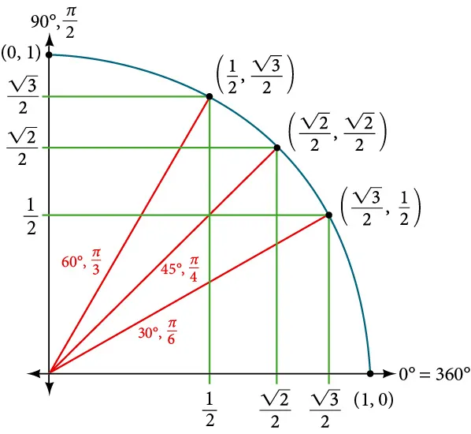

<div class="HEADER drawer">

</div>

# Introduction

The one dimensional integral that we shall evaluate using monte-carlo
methods gives the area of the a quarter of the unit circle. Using this
and the fact that the analytical value of the are of a quarter of the
unit circle is given as $\pi/4$, we can find the value of $\pi$.

$$
I = \int_0^1 f(x,y)\ dx = \int_0^1 \sqrt{1-x^2}\ dx = \frac{\pi}{4}
$$


The goal is to understand the strengths and weaknesses of the various
monte-carlo methods for the purpose of numerical integration.

# Monte-Carlo methods

Here, we shall test the various algorithms for numerical integration and
check their labour ratio.

## Hit or Miss

The crude method is the simplest and most inefficient monte-carlo
algorithm. It simply involves generating uniformly distributed random
points inside the unit square and counting the ratio of those points
that lie within the quarter circle. This gives us the ratio of the area
of the square and the circle. Since the are of the unit square is 1, the
are of the circle can be deduced directly.


The algorithm involves simply generating uniformly distributed set of
points within the range (0-1). The function we want to sample is given
as.

$$
\begin{equation}
g(x,y) =
\left\{
  \begin{array}{ll}
    1  & \mbox{if } \sqrt{1-x^2} \le 1 \\
    0  & \mbox{if } \sqrt{1-x^2} > 1
  \end{array}
\right.
\end{equation}
$$

Then the estimator given below is an unbiased estimator for the integral
$\theta$ for uniformly generated points ($x_i,y_i$) within the unit
square ($1,1$).

$$
\theta = \sum_i^N \frac{g(x_i,y_i)}{N}
$$

### Code (Matlab)

1.  Functions

    ``` matlab
    function result = hit_or_miss(p)
        x = p(1);
        y = p(2);
        if sqrt(x^2 + y^2) > 1
            result = 0;
        else
            result = 1;
        end
    end

    function result = hit_or_miss_var(inp)
        x = inp(1);
        meanpi = inp(2);
        result = (x - meanpi)^2;
    end
    ```

2.  Simulation

    ``` matlab
    nb = 24;
    corrlen = 0;
    npoints = 2^nb;
    npointsall = 2^nb + corrlen;
    randvalsx = rand(1, npointsall);
    randvalsy = rand(1, npointsall);
    pivalslist = zeros(1, npointsall);

    % Calculate via MC simul
    randpoints = [randvalsx; randvalsy]';
    meanpi = mean(arrayfun(@hit_or_miss, randpoints));
    pivals = arrayfun(@hit_or_miss, randpoints);
    meanpilist = meanpi * ones(1, npoints);
    varpivals = arrayfun(@hit_or_miss_var, pivals, meanpilist);
    errorpi = sqrt(sum(varpivals) / (npoints - 1)) / sqrt(npoints);

    % π
    exactI = pi/4;
    fprintf('meanpi = %f exact=%f \n error=%f errorExact=%f\n', meanpi, exactI, errorpi, exactI - meanpi);

    ```

## Crude monte-carlo

The crude method is the simplest and most inefficient monte-carlo
algorithm. It simply involves generating uniformly distributed random
points inside the unit square and counting the ratio of those points
that lie within the quarter circle. This gives us the ratio of the area
of the square and the circle. Since the are of the unit square is 1, the
are of the circle can be deduced directly.



The algorithm involves simply generating uniformly distributed set of
points within the range (0-1). The estimator for the integral $I$ is
given below.

$$
\theta = \sum_i^N \frac{f(\xi_i)}{N}
$$

with f being the function given as shown below.

$$
f(x) = \sqrt{1 - x^2}
$$

and $\xi_i$ is a uniform random number betwee ($0,1$).

### Code (Matlab)

1.  Functions

    ``` matlab
    function result = pi_curve(x)
        result = sqrt(1.0 - x^2);
    end

    function result = pi_curve_var(inp)
        x = inp(1);
        meanpi = inp(2);
        result = (x - meanpi)^2;
    end

    ```

2.  Simulation

    ``` matlab
    nb = 24;
    corrlen = 0;
    npoints = 2^nb;
    npointsall = 2^nb + corrlen;
    randvals = rand(1, npointsall);
    pivalslist = zeros(1, npointsall);

    % Calculate via MC simul
    meanpi = mean(arrayfun(@pi_curve, randvals));
    pivals = arrayfun(@pi_curve, randvals);
    meanpilist = meanpi * ones(1, npoints);
    varpivals = arrayfun(@pi_curve_var, pivals, meanpilist);
    errorpi = sqrt(sum(varpivals) / (npoints - 1)) / sqrt(npoints);

    % π
    exactI = pi/4;
    fprintf('meanpi = %f exact=%f \n error=%f errorExact=%f\n', meanpi, exactI, errorpi, exactI - meanpi);

    ```

## Stratified sampling

Stratified sampling involves breaking up the domain (i.e. 0 - 1) into
strata and sampling inside individual strata. The estimator for $\pi/4$
is then given by the following.

$$
\theta = \sum_{j=1}^k \sum_1^{n_j} (\alpha_j - \alpha_{j-1})\frac{1}{n_j}f(\alpha_{j-1}+(\alpha_j - \alpha_{j-1})\xi_{ij})
$$

The variance can be smaller than that of crude monte-carlo if
differences between local means is larger than the variance of $f$
within the stata.


### Code (Matlab)

1.  Functions

    ``` matlab
    function inter_list = interval_gen(nint)
        inter_list = linspace(0, 1, nint + 1);
    end

    function result = strat_rand(x, a, b)
        result = a + x * (b - a);
    end

    function strat_calc(x, list_npoints_inter, list_sum_inter, list_sum_inter2, list_sum_inter_witha, inter_list)
        idinter = find(inter_list <= x, 1, 'last') - 1;
        list_npoints_inter(idinter) = list_npoints_inter(idinter) + 1;
        list_sum_inter(idinter) = list_sum_inter(idinter) + pi_curve(x);
        δa = inter_list(idinter + 1) - inter_list(idinter);
        list_sum_inter_witha(idinter) = list_sum_inter_witha(idinter) + δa * pi_curve(x);
        list_sum_inter2(idinter) = list_sum_inter2(idinter) + pi_curve(x) * pi_curve(x);
    end

    function strat_rand_calc(x, a, b, list_npoints_inter, list_sum_inter, list_sum_inter2, list_sum_inter_witha, inter_list)
        x = a + x * (b - a);
        idinter = find(inter_list <= x, 1, 'last') - 1;
        list_npoints_inter(idinter) = list_npoints_inter(idinter) + 1;
        list_sum_inter(idinter) = list_sum_inter(idinter) + pi_curve(x);
        δa = inter_list(idinter + 1) - inter_list(idinter);
        list_sum_inter_witha(idinter) = list_sum_inter_witha(idinter) + δa * pi_curve(x);
        list_sum_inter2(idinter) = list_sum_inter2(idinter) + pi_curve(x) * pi_curve(x);
    end

    ```

2.  Simulation

    ``` matlab
    nb = 10;
    npint = 2;
    nint = 2^npint;
    corrlen = 0;
    npoints = 2^nb;
    npointsall = 2^nb;
    randvals = rand(1, npointsall);
    fprintf('%d\n', npointsall);

    list_npoints_inter = zeros(1, nint);
    list_sum_inter = zeros(1, nint);
    list_sum_inter2 = zeros(1, nint);
    list_sum_inter_witha = zeros(1, nint);
    inter_list = interval_gen(nint);
    list_mean_inter = zeros(1, nint);

    for i = 1:nint
        step = npointsall / 2^npint;
        a = inter_list(i);
        b = inter_list(i+1);
        idx = (step*(i-1)+1):(step*i);
        for j = idx
            strat_rand_calc(randvals(j), a, b, list_npoints_inter, list_sum_inter, list_sum_inter2, list_sum_inter_witha, inter_list);
        end
    end

    list_mean_inter = list_sum_inter_witha ./ list_npoints_inter;

    meanpi = sum(list_mean_inter);
    varpi = 0.0;
    for it = 1:nint
        δa = inter_list(it+1) - inter_list(it);
        nit = list_npoints_inter(it);
        varpi = varpi + δa^2 * (list_sum_inter2(it) - nit * list_mean_inter(it)^2) / (nit * (nit - 1));
    end

    errorpi = sqrt(varpi);
    exactI = 0.4180232931306735;
    exactI = pi/4;
    fprintf('meanpi = %f exact=%f \n error=%f errorExact=%f\n', meanpi, exactI, errorpi, exactI - meanpi);

    ```

## Importance sampling

The natural next step following stratified sampling is that of
importance sampling. In the previous method, we chose the strata
arbitrarily, i.e. by inspection of the function to integrate. This was
followed by a uniform sampling of points inside each strata. The idea is
to break the domain into regions which need to be sampled with more
points as opposed to domains where the function is quasi horizontal
(i.e. low variance). The more natural way to do this is to adapt the
choice of points in a more flexible manner. This is the idea behind
importance sampling where we define a custom distribution ($g(x)$) which
is very close to the original function ($f(x)$) that we wish to
integrate. The main constarint on the distribution is that it needs to
be easy to sample from.

$$
\theta = \int_0^1 f(x)\ dx = \int_0^1 \frac{f(x)}{g(x)} g{x}\ dx = \int_0^1 \frac{f(x)}{g(x)} dG(x)
$$

here, $dG(x)$ is the measure, i.e. the sampling distribution. Note that
the distribution $g(x)$ must be normalized.

$$
\int_0^1 g(x)dx = 1
$$

Invting a distribution,

### Code (Matlab)

1.  Function

    ``` matlab
    function result = gx(x)
        result = -2 * x;
    end

    function result = foverg(x)
        result = pi_curve(x) / gx(x);
    end

    function result = foverg_var(x, meanpi)
        result = (x - meanpi)^2;
    end

    function result = cdfm1(z)
        y = -sqrt(2 * z) / sqrt(2);
        result = y;
    end
    ```

2.  Simulation

    ``` matlab
    nb = 22;
    corrlen = 0;
    npoints = 2^nb;
    npointsall = 2^nb + corrlen;
    randvals = arrayfun(@cdfm1, rand(1, npointsall));

    % Calculate via MC simul
    pivals = arrayfun(@foverg, randvals);
    meanpi = mean(pivals);
    meanpilist = meanpi * ones(1, npoints);
    varpivals = arrayfun(@pi_curve_var, pivals, meanpilist);
    errorpi = sqrt(sum(varpivals) / (npoints - 1)) / sqrt(npoints);
    exactI = pi/4;

    fprintf('meanpi = %f exact=%f \n error=%f errorExact=%f\n', meanpi, exactI, errorpi, exactI - meanpi);

    ```
